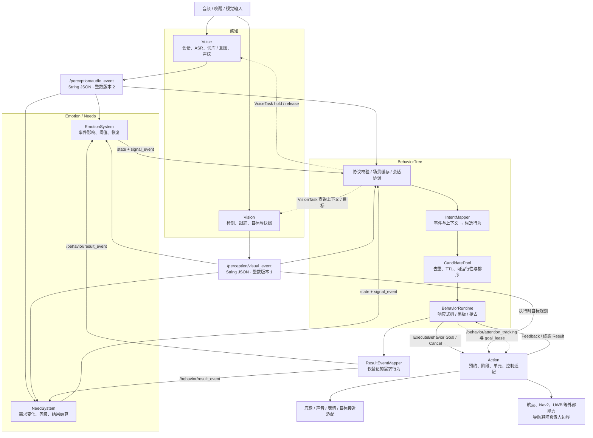
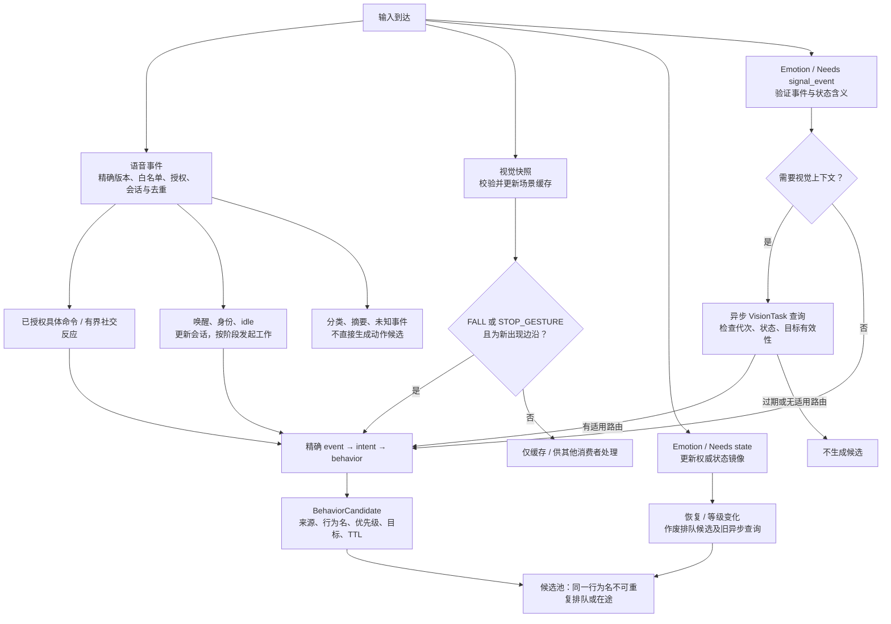
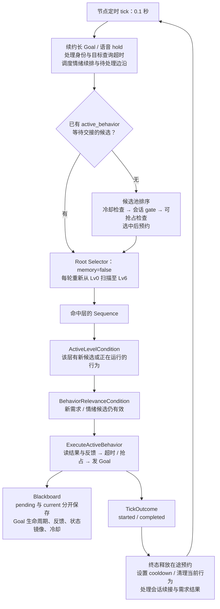
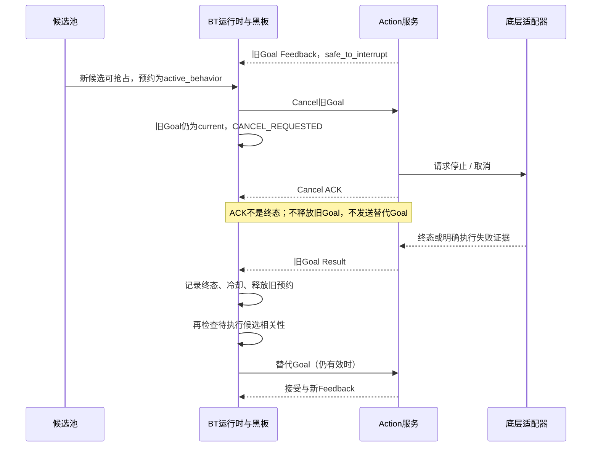
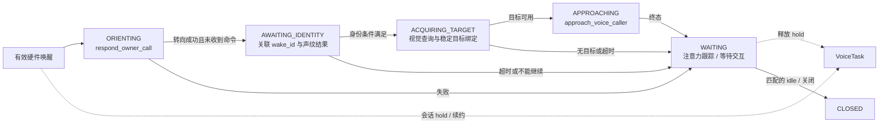
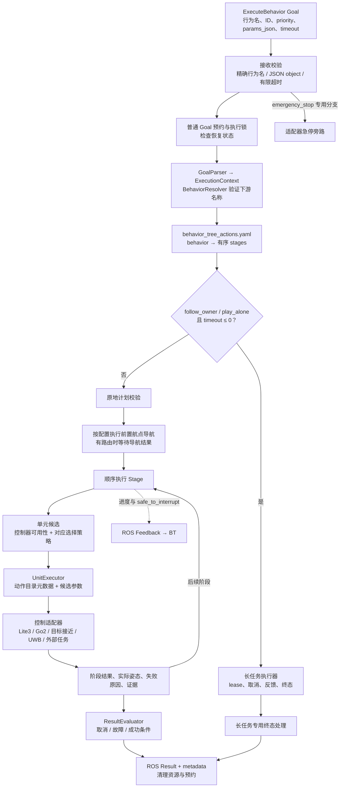

# MarsDog 事件到行为到动作架构

本文说明当前五模块如何把感知事件转成候选行为、如何激活与仲裁、如何执行动作并回流结果，供新增功能时定位修改位置。依据主仓运行代码及默认配置核对，代码基线为 `926f14b`，核对日期为 2026-09-30。

核心分工是：**Voice / Vision 提供观测，Emotion / Needs 持有内部状态，BehaviorTree 决定做什么和何时切换，Action 决定怎样分阶段执行。** 公共边界是 ROS 协议与配置契约；没有跨五模块共享的业务状态对象或总控 common。

本图描述实现路径。模型、底盘、导航是否为实物由启动 profile 和设备条件决定。默认本机组合使用感知 mock、模拟导航与设备；软件链路通过不等于动作已在真机验证。导航避障仅画外部边界，内部由对应负责人维护。

静态核对还发现 **49 条已配置事件路由的下游行为名缺少 Action 模板**，例如 comfort_soothe、dance、eat_meal。它们若被下发会遭 Action 拒绝；详见索引的未接通清单。五模块的兼容重构完成，不代表所有历史词库能力均已实现。本文只记录现状，不补写动作或改变机器人行为。

配套阅读：[完整配置索引](EVENT_BEHAVIOR_ACTION_INDEX.md)、[应用协议目录](../../interfaces/application/README.md)、[开发流程](../development/WORKFLOW.md)、[导航交接](../development/NAVIGATION_HANDOFF.md)。

## 1 先区分七种对象

| 对象 | 含义 | 当前例子 |
| --- | --- | --- |
| Event 事件 | 某个观测或状态变化发生了；不自带执行权限 | `EVT_VOICE_COMMAND_GO_HOME` |
| Intent 意图 | BT 对已认可事件的路由键 | `command_go_home` |
| Candidate 候选 | 待仲裁的行为提议，携带来源、优先级、强度、目标、期限 | `BehaviorCandidate` |
| Behavior 行为 | 一项有语义的任务；BT 选择此层 | `go_home`、`expressJoyWithHuman` |
| Goal 执行实例 | 某次行为执行的身份与生命周期 | `goal_id / behavior_id` |
| Stage 阶段 | Action 模板中有顺序的执行步骤 | `target_approach → expression` |
| Unit 动作单元 | 阶段内部执行的具体能力，由适配器实现 | `ACT_APPROACH_VISUAL_TARGET` |

同名 Behavior 可以先后执行多次，Goal ID 区分不同实例。BT 的候选池与 Action 阶段内的动作候选是两个不同层次的选择：前者决定任务竞争，后者决定该任务怎样表现。

## 2 五模块总览与反馈闭环



实线表示事件、状态、执行及结果流；虚线表示查询或控制流。感知事件同时可供多个消费者使用，各消费者保留自己的校验与容错策略。

| 边界 | 类型与版本 | 需要保留的语义 |
| --- | --- | --- |
| `/perception/audio_event` | `std_msgs/msg/String`，JSON 整数 `2` | 分类标签不等于执行授权；会话和句子 ID 用于关联 |
| `/perception/visual_event` | String，JSON 整数 `1`，BEST_EFFORT | epoch、快照、目标 ID、跟踪状态、距离有效性和新鲜度 |
| `/emotion/state`、`/emotion/signal_event` | String，版本字符串 `"2.0"` | 快照权威；信号负责触发边沿 |
| `/internal_need/state`、`/internal_need/signal_event` | String，版本字符串 `"2.0"` | 数值、阈值、等级、levelEvent 必须一致 |
| `/perception/voice/task` | `marsdog_voice_interaction/srv/VoiceTask` | 语音任务与会话 hold / release |
| `/perception/vision/task` | `marsdog_vision_interaction/srv/VisionTask` | 场景、人物、物体与目标查询 |
| `/execute_behavior` | `marsdog_interfaces/action/ExecuteBehavior` | Goal、Feedback、Result、Cancel；ACK 不代表终态 |
| `/behavior/result_event` | String JSON | 需求行为的 STARTED / 结果事件，不是同名生成消息类型 |
| `/waypoint_nav/task` | 历史复用 VoiceTask；协议 `"1.0"` | Action 请求导航；到达和取消都需要终态证据 |

VoiceTask 和 VisionTask 即使字段相同也不是同一个 ROS 类型。跨模块协议见 [interfaces/application](../../interfaces/application/README.md)，运行连接登记见 [registry.json](../../interfaces/registry.json)。

## 3 行为如何激活



### 3.1 语音入口

Voice 的 `speech_pipeline.py` 编排 ASR、声纹、KWS、词库与意图输出。BT 的执行入口由 `perception_client_adapter.py`、`audio_contract.py`、`IntentMapper` 和节点的会话分支共同把关。

- 普通具体命令要求精确配置的事件与 `command_id`，以及 `should_trigger_behavior_tree=true`、`dispatch_role=specific_command`、匹配的 `specific_event_type`、非空 `interaction_id / utterance_id`；有必需槽位时还要验证槽位。
- 当前普通命令路径没有单独强制 `is_executable`；不能把该字段画成所有路径共用的开关。
- `EVT_VOICE_COMMAND_PRAISE / SCOLD` 是明确授权的一次性社交反应：使用 `social_reaction`，并要求 `is_executable=false`。它们仍走候选池和仲裁。
- `COMMAND_KNOWN / UNKNOWN`、普通情绪/身份分类、`speech` 等不会直接进入执行；Emotion / Needs 可独立消费其领域含义。
- TOILET、CLEAN、SLEEP 另有需求门限，分别要求 Bladder > 50、Cleanliness > 40、Sleepiness > 50。未满足时不会仅凭口令执行。
- 唤醒、声纹回传和 idle 属于会话协调；旧会话或重复句子不得抢占新会话。饮食询问、PLAY 等还有节点内的有界特殊分支，因此只改 YAML 不保证所有新交互都接通。

### 3.2 视觉入口

当前直接激活 BT 的视觉事件只有 `EVT_VISION_FALL` 和 `EVT_VISION_STOP_GESTURE`，按出现边沿去重。连续快照重复同一事件不会重复激活；消失后再出现、或缓存失效后重新出现，按原规则重新判边。

`STRANGER`、人物与物体观测主要进入缓存或 Emotion；不是所有 `events[]` 都直接变成行为。目标绑定必须保留 `vision_epoch + target_id / track_id`、快照与新鲜度，身份字符串不能替代稳定目标引用。

### 3.3 状态驱动的激活与恢复

**state 快照更新状态和恢复，不直接注入新候选。** 情绪上升沿、需求等级变化来自 signal_event。信号也会先更新本地镜像，填补下一次周期快照到来前的间隙。

| 来源 | 激活规则 | 恢复与等待 |
| --- | --- | --- |
| Emotion | 接受六种 EMO_*_TRIGGERED，查询人物上下文，选择 WithHuman / Alone；会话等待时可选 InPlaceWithHuman | `triggered=false` 清理排队候选、待处理边沿、查询和续排；相关性检查只门控尚未开始的候选 |
| Needs | 接受精确 NEED_* 等级变化；非 NORMAL 时生成候选 | 完整快照先验证再应用；等级变化使旧等级候选失效，恢复使候选退出 |
| Hunger | 查询食物上下文 | 食物可见/不可见选择进食或寻食 |
| Social | 查询合格人物/动物 | 无适用目标则不生成该候选 |
| Exploration | 查询物体类别或空场景 | 分流为具体 inspect 行为或 exploreRoom |

默认 Needs 值是需求强度，越大需求越强；所有阈值均为严格 `>`：

| 需求 | TRIGGERED | URGENT | OVERFLOW | 主要优先级 |
| --- | ---: | ---: | ---: | ---: |
| Hunger | 70 | — | 90 | 3 |
| Bladder | 75 | — | — | 2 |
| Sleepiness | 65 | — | 90 | 2 |
| Cleanliness | 70 | — | — | 3 |
| Energy | 80 | — | 90 | 0 |
| Social | 60 | 70 | 85 | 4 |
| Exploration | 60 | — | — | 4 |

Energy 是充电需求强度，不能直接当作电池百分比。Emotion 的默认阈值是 `>=`：Joy 30、Excite 40、Anxiety 25、Fear 30、Curious 20、Calm 0；Calm 还保留自身心跳规则。**不能将 Emotion 的比较符与 Needs 统一替换。** 权威配置在 [demands.yaml](../../modules/emotion/configs/demands.yaml)、[emotions.yaml](../../modules/emotion/configs/emotions.yaml)。

非 Calm 情绪可有限续排：默认间隔 0.8 秒，最多 4 个执行周期、15 秒续排窗口，仍要求情绪触发、执行器空闲、重新解析上下文并通过候选门控。正常情绪候选 TTL 为 10 秒，cooldown 为 10 秒；这些限制同时存在，因此“最多 4 次”不表示必定执行 4 次或每 0.8 秒启动一次。窗口限制续排调度，不是正在运行 Goal 的统一超时。

## 4 候选池与行为树的仲裁

### 4.1 七级优先级

| priority_level | 类别 | 当前代表 |
| ---: | --- | --- |
| 0 | safety | emergency_stop、Energy 的 restInPlace / recharge |
| 1 | external_interaction | 语音命令、唤醒、直接视觉安全事件、有界社交反应 |
| 2 | urgent_physiology | 排泄提醒、睡眠 |
| 3 | normal_physiology | 饥渴、清洁 |
| 4 | psychological_need | 社交、探索 |
| 5 | emotion_expression | Joy / Fear 等状态触发的表达 |
| 6 | idle | 空闲层，保留给候选/运行行为 |

数字越小越优先。七级结构来自 `constants.py` 与 `behavior_categories.yaml`；部分旧注释曾把 Lv1 / Lv2 互换，以上按实际运行常量核对。Idle 分支存在不意味着树在没有任何候选时会自动产生 idle Goal。

### 4.2 排队候选如何排序

实际 `CandidatePool.select_best` 使用字典序，依次比较：

```text
priority_level ↑
semantic_rank ↑
modality_rank ↑
behavior_rank ↑（缺省取 params.sub_priority）
emotion_priority ↑
value ↓
created_at ↓（其余相同时，新候选优先）
```

这里 ↑ 表示从小到大，↓ 表示从大到小。不是把字段加权求一个总分，也不是 FIFO。

当前默认的语义排序：已配置的直接视觉安全事件 semantic_rank=0，具体语音命令=1，硬件唤醒=2，普通候选缺省=3。语音 modality_rank=1，视觉=2，缺省=3。因此，同为 Lv1 时，视觉 FALL 的语义优先级可高于普通语音命令，不能只按“听觉先于视觉”理解。

情绪顺序为 Fear → Anxiety → Excite → Joy → Curious → Calm；只有排在它前面的排序字段相同才比较它。语音 value 通常由置信度 × 100 得到，需求/情绪 value 来自强度；confidence 本身不是排序键中的独立一项。

池先清理正 TTL 已到期的候选，再逐个查找可运行者。处于 cooldown、被会话门控挡住或暂时不能抢占的候选留在池中，直到条件变化、权威状态作废或 TTL 到期。Needs 候选 TTL=0，表示由状态驱动失效而非计时过期。选中后，按 behavior_name 建立在途预约；同名行为不能再并发注入，`allow_repeat` 也不会绕过此约束。

### 4.3 每个 tick 的真实结构



主运行路径是 `BehaviorRuntime → bionic_dog_bt.actions.ExecuteActiveBehavior`。不要因文件名而把 `marsdog_behavior/execution_manager.py` 或旧 selector facade 误当成当前 ROS 主链。

树固定为 7 个类别分支，每层都是“层级条件 → 相关性条件 → 通用执行节点”。新增普通行为通常不需要新增树节点，而是增加映射、参数和 Action 模板。运行中的 Goal 由黑板持有；每次重扫树不会重启 Goal。

黑板中应特别区分：

- `active_behavior`：已选中、尚未发出或等待旧 Goal 终结的替代行为。
- `current_behavior / current_goal_id`：目前仍拥有执行权的行为与 Goal。
- `goal_lifecycle`：SENDING、RUNNING、CANCEL_REQUESTED、TERMINAL。
- `executor_feedback`：Action 的最新反馈，包括 safe_to_interrupt。
- `emotion_module / need_module`：权威领域状态的消费侧镜像，不是第二套生产状态引擎。

## 5 抢占不是重新选一个名字就执行

候选池排序决定“谁先被考虑”，`arbitration.evaluate_preemption` 决定“它能否打断当前行为”。抢占比较的基础键只有：

```text
K = (priority_level, semantic_rank, modality_rank, behavior_rank)
```

一般情况：新 K 小于旧 K 才有更高抢占优先级；K 相同则同会话更小的 session_preempt_rank 可优先，否则要求 `new.value - current.value >= 15`；K 更大不能抢占。emotion_priority 与创建时间参与排队排序，不直接构成抢占权限。

在基础键比较之前，代码有两个明确例外：新的已认可语音命令可替换 `audio_direct + until_preempted` 的长语音 Goal；硬件唤醒的 respond_owner_call 可替换 follow_owner / play_alone。例外仍需通过当前行为的中断策略。

| 当前行为的 interrupt_policy | 普通抢占还要满足 |
| --- | --- |
| immediate | 有最新反馈，状态不是 DISPATCHED / RECOVERY_REQUIRED，且 safe_to_interrupt=true |
| safe_point | 同上，等待安全反馈 |
| non_interruptible | 普通候选不能抢占 |
| 未知策略 / 无反馈 | 不允许普通抢占 |
| 新行为 emergency_stop 且 Lv0 | 在中断策略检查中可覆盖以上策略 |



超时也先请求取消并等待终态，不以“本地秒表到了”伪造底层已停止。Action 对普通 Goal 另有预约与执行锁，旧任务未清理时拒绝新的普通执行。

Action 服务有 emergency_stop 旁路，会直接请求各已接入适配器停止；BT 自身仍受当前 Goal 的持有与交接流程约束，特别是已有 CANCEL_REQUESTED 时不会再选择新候选。因此 Lv0 仲裁规则不能被解读成无条件的物理急停时延保证。

导航终态未知时保留恢复约束；普通候选不能将 RECOVERY_REQUIRED 当作空闲。人工 release_recovery 是导航侧的显式恢复操作，不等于导航成功，也不能由自动客户端凭空生成确认。

来源：[arbitration.py](../../modules/behavior/bionic_dog_bt/arbitration.py)、[actions.py](../../modules/behavior/bionic_dog_bt/actions.py)、[runtime.py](../../modules/behavior/marsdog_behavior/runtime.py)、[goal_lifecycle.py](../../modules/action/marsdog_action_executor/goal_lifecycle.py)。

## 6 语音会话为何会影响行为激活

以下画出正常的硬件唤醒续接；它与 BT Goal 生命周期并行存在。



已授权命令可以接管当前 turn，使尚未执行的唤醒续接退出；上图不是所有会话异常分支的枚举。目标查询以 generation、interaction_id、wake_id 和当前状态过滤迟到结果。

会话移动阶段和 attention tracking 相当于额外的 Lv1 运行门控：priority_level ≤ 1 仍交给正常仲裁；更低优先级一般等待。WAITING 或命令 Goal 已终结后，可放行严格匹配本会话、有效人物目标、`mobility_policy=in_place` 的 `express*InPlaceWithHuman`。Action 还会校验该原地计划，避免等待时的情绪表达意外变成接近动作。

attention tracking 是旁路会话控制，不是候选池中的一个普通 Goal；不能通过“Action 没有 Goal”推断所有运动相关状态都空闲。

普通语音行为缺省随 voice_session 生命周期；匹配 idle 可能清理候选并取消会话所属 Goal。follow_owner / play_alone 明确使用 `lifecycle_scope=behavior`、`completion_policy=until_preempted`、`cancel_on_voice_idle=false`，持续运行并通过 `/behavior/goal_lease` 续约。长 Goal 的结束条件由取消、替换、lease 和执行故障等路径决定。

来源：[voice_engagement.py](../../modules/behavior/marsdog_behavior/voice_engagement.py)、[voice_interaction_session.py](../../modules/behavior/marsdog_behavior/voice_interaction_session.py)、[voice_engagement.yaml](../../modules/behavior/config/voice_engagement.yaml)、[lifecycle.py](../../modules/behavior/marsdog_behavior/lifecycle.py)。

## 7 Action 如何把行为变成动作



Action 内部的主要配置分工：

| 文件 | 定义什么 | 不负责什么 |
| --- | --- | --- |
| [behavior_tree_actions.yaml](../../modules/action/config/behavior_tree_actions.yaml) | 可执行行为名、阶段、候选单元、选择/失败/成功策略 | 上游事件授权与 BT 仲裁 |
| [action_catalog.yaml](../../modules/action/config/action_catalog.yaml) | Unit 类型、参数、姿态、中断等元数据 | 决定何时激活该行为 |
| [controller_routes.yaml](../../modules/action/config/controller_routes.yaml) | 公共 Unit → controller 路由 | 声称该硬件一定可用 |
| [lite3_actions.yaml](../../modules/action/config/lite3_actions.yaml) / [go2_sport.yaml](../../modules/action/config/go2_sport.yaml) | 对应底盘的实现计划和覆盖路由 | 改写事件含义 |
| [navigation_waypoints.yaml](../../modules/action/config/navigation_waypoints.yaml) | 行为航点及阶段边界 | 导航避障内部算法 |
| [sound_config.yaml](../../modules/action/config/sound_config.yaml) | 行为/阶段声音 | 行为仲裁 |

有效控制路由由 ConfigLoader 合并公共路由、所选底盘动作计划和 overrides 得出，仅查看 controller_routes.yaml 不够。默认公共未知路由为 unsupported。Motion-critical Unit 若要求控制器而控制器不可用，必须失败，不能悄悄用 mock 的完成代替真实能力。

普通阶段会先考虑控制器可用性，然后按策略选单元。当前配置索引会列出每个阶段的真实策略：

- `random_one / weighted_random`：EligibilityChecker 过滤条件、姿态和授权后选择。
- `condition_first`：按顺序选第一个满足条件的候选。
- `fixed / sequence`：当前实现直接按候选顺序执行，不走相同的 eligibility 过滤分支；扩展时必须自行核对所需前置条件。
- `loop_random`：有独立循环实现。
- ConfigLoader 接受 `random_n` 名字，但当前 StageExecutor 没有独立的 N 项选择分支，会落入选择一个候选的缺省逻辑；不要只依据注释或枚举推断能力。也不要把 failure_policy 中的 retry 名字当作已实现的通用重试机制。

当前实际加载的 74 个行为模板包含 134 个阶段，选择策略全部为 random_one；以上其他分支是代码支持程度的说明，不能当作当前模板正在使用。

通常必需阶段失败且策略为 abort 会停止后续阶段；skip_stage / 可选阶段按各分支处理。最终成功由模板的 success_condition 与 ResultEvaluator 决定。Feedback 的安全标志来自执行状态或具体适配器，不是“动作已完成”的另一种写法。

`ACT_*` 名称表达语义能力，不保证选定底盘物理上实现了同名动作。Lite3 的 fidelity / verified 等门限与返回的实际姿态必须保留；例如当前验收中 SIT 可以走到 Action，但会被未验证的 proxy 能力门控拒绝。

## 8 结果如何影响下一轮行为

Action Result 返回 Goal 身份、status/result/reason、reward、JSON metadata 等。BT 的 ActionClientAdapter 将其转回本地执行结果；Runtime 到终态才释放预约、设置 cooldown，节点再处理会话续接与情绪续排。

`ResultEventMapper` 只为 `BEHAVIOR_ACTION_MAP` 登记的需求行为发布 /behavior/result_event，包括 STARTED 与终态。过滤依据是**行为名登记**，不是“是否由语音触发”；语音若复用需求行为，仍可能进入该闭环。候选 params 内的 result_mapping 不是给任意新行为自动开通结算的注册机制。

Emotion 与 Needs 均订阅此结果主题，但各自解释：

- Emotion 根据完成、未满足、中断等结果更新情绪。
- Needs 根据 action_type / demand_type、去重 ID、结果类别和 metadata 执行领域规则。睡眠 STARTED 有专用进入睡眠处理；COMPLETED 才走相应完成分支；中断/取消/超时可能应用已有的中断需求变化或唤醒规则，不能概括为“非成功完全不改状态”。
- recharge 即使收到完成或中断，也只有合法、非模拟、足够新的 battery_observation 才更新电量对应的 Energy。证据要求包括整数版本 1、来源、有限 0..100 百分比和 0..5 秒观测年龄；旧 energyValue 标量不足以证明测量。
- 当前 Action 未接入已验证 BMS 观测生产者，restInPlace / recharge 成功时会标注 observation_unavailable，不伪造电量；go_home 不在 Energy 结算映射中。
- Needs 完成某次结算后，若仍满足需求，可通过既有等级信号/重触发机制发起下一轮；不能让 BT 自行把需求值归零。

来源：[result_event_mapper.py](../../modules/behavior/marsdog_behavior/result_event_mapper.py)、[constants.py](../../modules/behavior/bionic_dog_bt/constants.py)、[need_system.py](../../modules/emotion/marsdog_core/need_system.py)、[emotion_system.py](../../modules/emotion/marsdog_core/emotion_system.py)、[battery_observation.py](../../modules/emotion/marsdog_core/battery_observation.py)。

## 9 两条真实配置路径

### 9.1 语音回家

```mermaid
flowchart LR
  S["ASR 文本：回家"] --> V["Voice 分类 / 授权输出<br/>EVT_VOICE_COMMAND_GO_HOME"]
  V --> I["BT 校验 CMD_GO_HOME<br/>intent=command_go_home"]
  I --> C["候选 go_home<br/>Lv1 · TTL默认8秒 · timeout60秒"]
  C --> B["排队 / 仲裁 / Goal交接"]
  B --> G["ExecuteBehavior<br/>behavior_name=go_home"]
  G --> N["启用导航的部署<br/>前置航点 A：卧室"]
  N --> U["navigation 阶段<br/>ACT_NAV_GO_HOME"]
  U --> R["Result → BT释放与冷却"]
  R --> E["不生成 Energy 结算"]
```



当前配置中 go_home 是 A（卧室）；充电需求的 restInPlace / recharge 是 B（充电桩）。生产 navigation_waypoints.yaml 默认 enabled=false，本机 profile 使用生成的启用配置。航点路由与阶段协作避免把已有前置导航误解为要再次发送同一导航任务，细节以 BehaviorMobilityAdapter 为准。

此前 ASR 验收的真实 WAV 是中性语句，回家动作通过独立文本注入验证；没有据此宣称“真实麦克风说回家到实物动作”已验收。

### 9.2 Joy 状态触发

`EMO_JOY_TRIGGERED → 更新 Joy 镜像并查询人物 → human / solo / voice_waiting 路由 → expressJoyWithHuman / expressJoyAlone / expressJoyInPlaceWithHuman → Lv5 候选 → 仲裁`。

WithHuman 模板先执行 `target_approach: ACT_APPROACH_VISUAL_TARGET`，成功后进入 expression，从相应表情/动作单元中选择；接近失败不应进入后续互动表达。正常情绪需让位于更高优先级行为与语音移动会话；恢复会清理未开始的表达，有限续排需要重新验证状态与目标。

## 10 新增功能时改哪里

| 想增加的功能 | 主要修改位置 | 同时核对 |
| --- | --- | --- |
| 新说法映射到已有命令 | Voice command_catalog 及原分类路由 | 事件身份、授权字段、词库测试；通常无需改 Action |
| 新的可执行语音事件 | Voice 事件生产 + BT event_intent_map / intent_action_pool | audio_contract、节点特殊分支、槽位、去重、会话、TTL |
| 新视觉直接行为 | Vision 事件生产 + BT 直接白名单与映射 | 是否真应直接激活、出现边沿、目标新鲜度；不可仅往 events[] 填字符串 |
| 新情绪影响规则 | Emotion configs/emotions + 感知适配 | 阈值/比较符、去重/恢复、输出契约 |
| 新需求行为或分级 | Emotion demands / 等级信号 + BT 需求映射与上下文路由 | 候选失效、需求结算、严格 gt、结果重触发 |
| 已有行为换动作组合 | Action behavior_tree_actions + 已有 Unit | 阶段顺序、required、失败策略、声音、成功条件 |
| 全新动作能力 | Action action_catalog + UnitExecutor / adapter + 底盘映射 | 支持度、取消、安全反馈、实际姿态、证据；不能只登记 ACT 名 |
| 新人物/物体互动 | VisionTask 与 BT 上下文解析、Action target adapter | epoch、目标引用、距离有效性、迟到查询作废 |
| 修改优先级/抢占 | BT categories / candidate params / arbitration | 排队顺序和抢占条件分别验证，保留会话和终态交接 |
| 新需求结算 | BT BEHAVIOR_ACTION_MAP + Emotion/Needs 结果处理 | STARTED、失败、中断、去重与证据；不直接写跨模块内部状态 |
| 新导航/避障算法 | 对应 robotics 模块负责人 | 本文仅使用既有外部接口，先读导航交接 |

新增普通行为的推荐顺序：

1. 写出一条明确链路：输入事件、授权条件、语义行为、目标要求、可抢占条件、执行结果与是否结算。
2. 查[配置索引](EVENT_BEHAVIOR_ACTION_INDEX.md)，优先复用已有 Behavior / Unit；确认名称大小写和下游模板一致。
3. 在 owning module 增加配置或实现。跨模块靠现有协议传递；不从 BT import Action / Vision 私有实现。
4. 为新行为补 TTL、timeout、cooldown、interrupt_policy、会话归属；持续任务还需结束与 lease 语义。这些时间分别是排队、执行、重入和保活，不能混用。
5. 如需新 Unit，先完成适配器的执行、取消、失败、能力与证据接口，再将其接入模板。
6. 验证正常完成、被高优先级打断、目标消失、无能力/控制器失败，以及同事件重复或结果迟到；需要结算时额外验证失败和中断不会被当作完成。
7. 按下表运行受影响门禁，并同步本说明及索引。没有修改实现的纯文档更新不冒称重新完成硬件验收。

| 修改边界 | 对应门禁入口 |
| --- | --- |
| 基础架构 / 工具 | `python3 tools/dev.py check` |
| 所属模块逻辑 | `python3 tools/dev.py test <module>`，ROS 要求见开发流程 |
| Audio / Visual / State 契约 | `check_audio_contracts.py` / `check_visual_contracts.py` / `check_state_contracts.py` |
| VoiceTask / VisionTask | `check_task_contracts.py` |
| Action → BT → Needs | `check_contracts.py` |
| Action 回调 / 取消传输 / 关闭 | `check_action_callbacks.py` / `check_action_transport.py` / `check_action_shutdown.py` |
| 安装后业务与恢复 | `check_business_scenarios.py`、默认 smoke |

各门禁的环境、参数和边界以 [WORKFLOW.md](../development/WORKFLOW.md) 与 [BUSINESS_SCENARIOS.md](../development/BUSINESS_SCENARIOS.md) 为准。纯测试、DDS、模型与设备证据分开记录。

## 11 从图定位代码

| 层 | 权威入口 |
| --- | --- |
| Voice 编排 / 会话 | [speech_pipeline.py](../../modules/voice/marsdog_voice_interaction/core/speech_pipeline.py)、[interaction_session.py](../../modules/voice/marsdog_voice_interaction/core/interaction_session.py) |
| Vision 快照 / 事件 | [visual_snapshot.py](../../modules/vision/marsdog_vision_interaction/core/visual_snapshot.py)、[visual_event_derivation.py](../../modules/vision/marsdog_vision_interaction/messages/visual_event_derivation.py) |
| Emotion / Needs | [emotion_system.py](../../modules/emotion/marsdog_core/emotion_system.py)、[need_system.py](../../modules/emotion/marsdog_core/need_system.py) |
| BT 感知输入 / 状态 | [perception_client_adapter.py](../../modules/behavior/marsdog_behavior/perception_client_adapter.py)、[state_subscriptions.py](../../modules/behavior/marsdog_behavior/state_subscriptions.py) |
| BT 激活映射 | [intent_mapper.py](../../modules/behavior/marsdog_behavior/intent_mapper.py)、[event_intent_map.yaml](../../modules/behavior/config/event_intent_map.yaml)、[intent_action_pool.yaml](../../modules/behavior/config/intent_action_pool.yaml)、[emotion_behavior_map.yaml](../../modules/behavior/config/emotion_behavior_map.yaml) |
| BT 仲裁与树 | [candidate_pool.py](../../modules/behavior/marsdog_behavior/candidate_pool.py)、[arbitration.py](../../modules/behavior/bionic_dog_bt/arbitration.py)、[runtime.py](../../modules/behavior/marsdog_behavior/runtime.py)、[tree_builder.py](../../modules/behavior/bionic_dog_bt/tree_builder.py)、[actions.py](../../modules/behavior/bionic_dog_bt/actions.py) |
| BT ROS 协调 / Action 客户端 | [ros_node.py](../../modules/behavior/marsdog_behavior/ros_node.py)、[action_client_adapter.py](../../modules/behavior/marsdog_behavior/action_client_adapter.py) |
| Action Goal 边界 | [goal_contract.py](../../modules/action/marsdog_action_executor/goal_contract.py)、[goal_lifecycle.py](../../modules/action/marsdog_action_executor/goal_lifecycle.py)、[goal_execution.py](../../modules/action/marsdog_action_executor/goal_execution.py) |
| Action 执行与判定 | [stage_executor.py](../../modules/action/marsdog_action_executor/stage_executor.py)、[eligibility_checker.py](../../modules/action/marsdog_action_executor/eligibility_checker.py)、[unit_executors.py](../../modules/action/marsdog_action_executor/units/unit_executors.py)、[result_evaluator.py](../../modules/action/marsdog_action_executor/result_evaluator.py) |
| 设备和外部能力 | [Action adapters](../../modules/action/marsdog_action_executor/adapters)、[导航交接](../development/NAVIGATION_HANDOFF.md) |

文档按实际分支与已加载配置描述当前实现；历史注释、兼容 facade、配置枚举和架构提案不能单独证明某能力已接入。新增能力后应同时维护图、契约、配置索引和验证证据。
