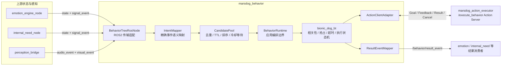
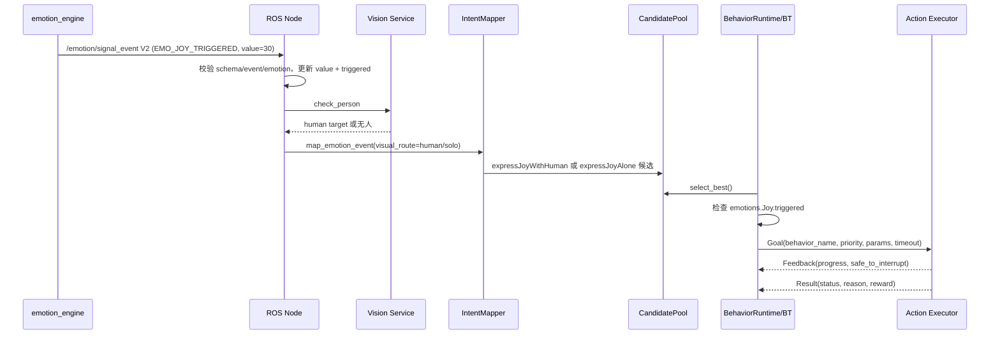

# MarsDog Behavior 通信与运行时架构

本文以当前代码为准，说明上游事件如何进入决策系统、行为树如何仲裁，以及结果如何回传。

## 1. 系统边界



职责边界：

- `BehaviorTreeRosNode` 负责 ROS2 建连、JSON 解码、上游事件编排、日志和结果发布。
- `IntentMapper` 把外部事件转换成带来源、意图、优先级、TTL 和中断策略的候选。
- `CandidatePool` 是线程安全的候选队列。它不会在每个 tick 丢弃未选候选。
- `BehaviorRuntime` 负责候选仲裁、`ActiveBehavior` 转换、BT tick，以及 STARTED/终态观察。
- `bionic_dog_bt` 是无 ROS2 依赖的执行状态机；抢占规则只有一份，位于 `arbitration.py`。
- `ActionClientAdapter` 只做 `/execute_behavior` 的异步通信适配。
- 动作序列和硬件控制属于下游 `marsdog_action_executor`，本项目只发送语义 `behavior_name`。

## 2. 上游输入

| 输入 | QoS | 处理方式 | 是否直接生成候选 |
|---|---|---|---|
| `/emotion/state` | BEST_EFFORT, depth=5 | V2：更新数值和 `triggered`，处理恢复 | 否 |
| `/emotion/signal_event` | RELIABLE, depth=10 | V2：单阈值上升沿映射情绪行为 | 是 |
| `/internal_need/state` | BEST_EFFORT, depth=5 | V2：更新完整需求状态和相关性 | 否 |
| `/internal_need/signal_event` | RELIABLE, depth=10 | V2：同步等级变化，再映射需求行为 | 是（RECOVERED 除外） |
| `/perception/audio_event` | RELIABLE, depth=10 | 仅处理名字唤醒和可执行语音指令白名单 | 是 |
| `/perception/visual_event` | BEST_EFFORT, depth=5 | 缓存 humans/active_target/tracked_objects，作为视觉服务回退 | 否 |

情绪 V2 的 `state` 和 `signal_event` 分工：

- `signal_event` 只表示阈值上升沿，负责创建一次候选。
- `state.emotions.<name>.triggered` 表示当前是否仍达到阈值，在执行前用于相关性校验。
- signal 回调会立即把对应情绪标为 triggered，避免等待下一次 1 Hz state 心跳。
- 恢复、持续升高和主导情绪变化不生成 signal；恢复只由 state 的 false 表示。

### 情绪链路



### 需求链路

需求 state 和 signal 均只接受 `schema_version="2.0"`。首次触发线读取
`triggerThreshold / triggerOperator`，可选中间紧急线读取
`urgentThreshold / urgentOperator`。所有需求都按 `event_intent_map.yaml`
中的完整 `event_type` 映射；Social 的 `TRIGGERED / URGENT / OVERFLOW`
使用三个不同 Behavior。Bladder、Cleanliness、Exploration 没有
`OVERFLOW`，值到 100 仍维持 `TRIGGERED`。

signal 负责生成一次候选；state 的 `triggered` 负责当前相关性。
Social 在 URGENT/OVERFLOW 时仍为 `triggered=true`。Energy 输入值是电量缺口，
候选强度直接使用该原始值；结果 metadata 中的电量字段仍表示实际电量。
需求行为的 STARTED、COMPLETED、FAILED、TIMEOUT、INTERRUPTED 会映射到
`/behavior/result_event`。

### 音频与视觉链路

- `EVT_VOICE_CALL_NAME` 直接开启会话级视角跟踪，不创建 Action 候选；已配置的
  `EVT_VOICE_COMMAND_<ACTION>` 完整事件名进入行为决策。
- PRAISE、SCOLD、HAPPY、SAD 等音频事件由情绪系统消费，行为树不重复处理。
- visual `events` 不创建候选，避免绕过情绪/需求系统重复触发。
- 六类情绪 signal_event 都异步调用 `check_person`：有人时生成独立的
  `*WithHuman` Behavior，无人时生成独立的 `*Alone` Behavior，共 12 个
  语义行为；Action Client 再通过 `executor_behavior_name` 适配执行端已有
  的六个 `express*` 模板。
- Hunger/Social/Exploration 需求事件异步调用 `/perception/vision/task`：
  Hunger 使用 `detect_objects` 区分狗粮可见与需要找食物；
  Social 先 `check_person`，无人时再 `detect_objects`；Exploration 调用
  `detect_objects`。服务不可用时才使用 visual topic 的场景缓存。

## 3. Tick、仲裁与抢占

默认每 100 ms 执行一次：

1. 候选池删除过期候选。
2. 按 `priority_level ASC → sub_priority ASC → intensity DESC → created_at DESC` 选出一个不在冷却期的候选。
3. 未选候选继续留在池中；冷却中的候选等待冷却结束或 TTL 到期。
4. 候选转换为 `ActiveBehavior`，完整保留 `candidate_id`、TTL 来源时间和 `interrupt_policy`。
5. reactive root 从 Lv0 到 Lv6 重新评估。
6. 情绪和需求候选都检查对应 state 的 `triggered`；等级变化时清除旧等级候选。
7. 执行节点决定启动、继续、抢占、超时或完成。

抢占规则集中在 `bionic_dog_bt/arbitration.py`：

- 更低的 level 数字优先级更高。
- 同级只有强度差达到 15 才能抢占。
- 当前行为的 `immediate / safe_point / non_interruptible` 决定能否中断。
- Lv0 `emergency_stop` 无条件覆盖其他中断策略。

抢占同一 tick 内先产生旧行为 `INTERRUPTED`，再产生新行为 `STARTED`。超时会产生明确的 `TIMEOUT` 终态，不再只停留在内部日志。

## 4. 下游 Action 通信

Goal 只传递：

- `goal_id`
- `behavior_name`
- `priority_level`
- `params_json`
- `timeout_sec`

Feedback 的 `safe_to_interrupt` 参与 safe-point 抢占。Result 转换成内部 `BehaviorFeedbackEvent`。Action Server 未就绪、Goal 被拒绝或异步 future 异常时，适配器会生成 `FAILURE` 结果，避免黑板永久保持 RUNNING。

取消可能发生在 Goal 异步响应之前。适配器记录待取消 ID，并在 Goal Handle 到达后立即取消，同时忽略其迟到 feedback/result，避免被抢占行为继续执行或污染缓存。

## 5. 并发与一致性

- 默认 `rclpy.spin(node)` 使用单线程执行器，subscription 与 timer 回调串行；`CandidatePool` 仍用锁保护队列和去重键，以支持测试和未来多线程执行器。
- Action feedback/result 回调异步写缓存；`ActionClientAdapter` 用独立锁保护 goal 状态。
- 上游回调更新黑板的情绪/需求输入状态，tick 更新行为执行状态。
- 周期 state 是当前事实，signal 是边沿事件；两者不能互相替代。

## 6. 配置与部署

配置目录按以下顺序解析：

1. 调用方显式目录；
2. `MARSDOG_BEHAVIOR_CONFIG_DIR`；
3. 源码仓库的 `config/`；
4. ROS2 package share 的 `config/`。

因此源码运行、普通 Python 安装和 ROS2 安装使用同一套解析逻辑。所有映射文件都由 `setup.py` 安装到 package share。

## 7. 依赖方向

```text
ROS2 / standalone entry
        ↓
marsdog_behavior adapters + BehaviorRuntime
        ↓
bionic_dog_bt pure runtime
```

`bionic_dog_bt` 不依赖 ROS2 或 `marsdog_behavior`。跨入口共享的仲裁规则应放在纯运行时层；ROS2 消息解析、Action/Service 类型只能留在适配层。
